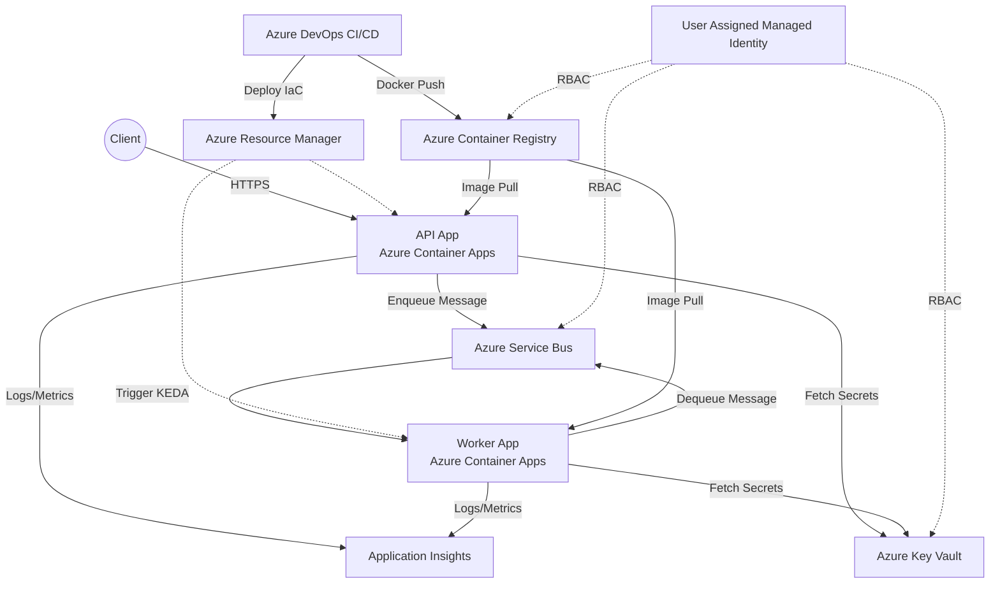

# Azure Cloud-Native Platform - Complete Deployment Guide

Welcome to the complete implementation guide for the cloud-native, production-ready .NET 8 solution on Azure. This guide assumes you have **zero local setup** and will walk you through executing this entirely in the cloud.

## 1. End-to-End Architecture



### 1.1 Why these specific Azure Services?
- **Azure Container Apps (ACA)**: Chosen over App Service because ACA is strictly built for microservices and natively supports **KEDA** (Kubernetes Event-driven Autoscaling). This allows our background worker to scale to ZERO when the queue is empty, and dynamically scale up based on the Service Bus queue length.
- **Azure Service Bus**: Enterprise-grade message broker providing reliable queueing, dead-lettering, and sessions.
- **User Assigned Managed Identity**: Completely eliminates the need to manage credentials, connection strings, or secrets. The application authenticates via Microsoft Entra ID.
- **Azure Key Vault**: Meets enterprise requirements for secret management, even if Managed Identity reduces our reliance on them.
- **Bicep (IaC)**: Microsoft's native declarative language. Much cleaner than ARM templates and provides seamless integration without state files (unlike Terraform, which requires remote backend state management).

---

## 2. Setting Up Your Azure Account

If you do not have an Azure Free account setup yet:
1. Go to [azure.microsoft.com/free](https://azure.microsoft.com/free/).
2. Click **Start free**.
3. Sign in with a Microsoft account or create a new one.
4. Verify your identity by phone and provide a credit card (you will **not** be charged unless you remove the spending limit).
5. Once your account is created, go to the [Azure Portal](https://portal.azure.com/).

---

## 3. Creating the Cloud Environment (Zero Local Setup)

We will use **Azure Cloud Shell** right from your browser.

1. In the Azure Portal, click the `>_` icon at the top right to open **Cloud Shell**.
2. Select **Bash**. (If prompted, create a storage account for Cloud Shell).
3. We need to upload the generated code files to a Git repository in Azure DevOps. First, let's setup Azure DevOps.

### 3.1 Azure DevOps Organization Setup
1. Go to [dev.azure.com](https://dev.azure.com/).
2. Create a new Organization (e.g., `my-cloud-platform-org`).
3. Create a new Project named `AzurePlatform`.
4. Navigate to **Repos** in your new project. You will see an empty repository.
5. Generate Git Credentials: Go to **Repos -> Files**, click **Clone**, then **Generate Git Credentials**. Copy the password.

### 3.2 Pushing Code via Cloud Shell
Back in the Azure Portal Cloud Shell, run the following commands to initialize your git repository and push the code:

```bash
# Clone the empty Azure DevOps repository
git clone https://dev.azure.com/<your-org>/AzurePlatform/_git/AzurePlatform
cd AzurePlatform

# Upload or create the files inside this directory.
# Since the AI generated this folder structure locally in your workspace, you can push them from there,
# or drag-and-drop them into the Cloud Shell editor:
code .
```

Once the files (`src/`, `infra/`, `.ado/`) are inside the `AzurePlatform` folder:

```bash
git add .
git commit -m "Initial commit of cloud platform"
git push origin main
```

---

## 4. Configuring the CI/CD Pipeline

The `.ado/azure-pipelines.yml` file is already in your repository.

### 4.1 Service Connections (Crucial Step)
Azure DevOps needs permission to talk to your Azure Subscription.
1. In Azure DevOps, go to **Project Settings** (bottom left) -> **Service connections**.
2. Click **New service connection** -> **Azure Resource Manager** -> **Workload Identity federation (automatic)**.
3. Select your Subscription.
4. Name the connection: `ArmConnection`.
5. Grant access permission to all pipelines.
6. Create another service connection for the Docker Registry. Choose **Docker Registry** -> **Azure Container Registry**. (Note: The ACR doesn't exist yet, so we will deploy the Bicep template manually once, or create the ACR via CLI first to set up the connection).

### 4.2 Pipeline Setup
1. Go to **Pipelines** -> **Create Pipeline**.
2. Select **Azure Repos Git** -> `AzurePlatform`.
3. Select **Existing Azure Pipelines YAML file**.
4. Choose the `/.ado/azure-pipelines.yml` path.
5. Before running, create a Variable Group!

### 4.3 Variable Group
1. Go to **Pipelines** -> **Library**.
2. Create a Variable Group named `azure-platform-vars`.
3. Add a variable: `subscriptionId` = `<your-azure-subscription-id>`.
4. Add a variable: `acrLoginServer` = `<your-acr-name>.azurecr.io`.
5. Save the variable group.

### 4.4 Environments (Approvals)
1. Go to **Pipelines** -> **Environments**.
2. Create an environment named `PPD`.
3. Click the 3 dots on the PPD environment -> **Approvals and checks**.
4. Add an **Approval**, assign yourself as the approver.

---

## 5. Security & Observability

### 5.1 Secrets Management & Managed Identity
- We strictly adhere to **Zero Secrets in Code/Pipelines**.
- The API and Worker authenticate to Key Vault and Service Bus using **DefaultAzureCredential**.
- The Bicep template assigns `ServiceBusDataOwner` and `KeyVaultSecretsUser` to a **User Assigned Managed Identity**, which is then attached to the Container Apps.
- During infrastructure deployment, Bicep passes the Managed Identity Principal ID to Role Assignments dynamically. No connection strings are stored anywhere.

### 5.2 Observability implementation
- **Application Insights** is attached to both the API and Worker.
- In `.NET 8`, the SDK automatically correlates traces between the API (HTTP request -> Service Bus enqueue) and the Worker (Service Bus dequeue -> processing) using W3C Trace Context.
- Health checks are exposed at `/health/live` and `/health/ready`, which Container Apps uses to restart unhealthy replicas.

---

## 6. Scaling & Resiliency

- **Retry Policies**: Handled implicitly by Azure Service Bus. Messages that fail processing (e.g. exceptions thrown in the Worker) are automatically retried up to 10 times (`maxDeliveryCount: 10`).
- **Dead-Letter Queue (DLQ)**: If a message fails 10 times, it is pushed to the DLQ. Our worker code also explicitly dead-letters messages on specific failures.
- **KEDA Auto-scaling**: The Container App worker is configured with a KEDA scale rule: `messageCount: '10'`. If the queue has 50 messages, KEDA spins up 5 worker replicas. If the queue is empty, it scales down to `0`, saving costs.

---

## 7. Cost Optimization & Production Best Practices

- **Consumption Tier**: Both Azure Container Apps and Service Bus use Consumption/Standard tiers which cost pennies when idle.
- **Scale to Zero**: The background worker stops completely when there is no work.
- **Avoid Admin Credentials**: Disabling ACR admin user forces the use of Microsoft Entra ID (Managed Identity), which is highly secure and required by enterprise audits.
- **Resource Naming**: We use strict naming conventions like `ca-api-dev` and `rg-azplat-dev-eastus` separating resource type, app name, and environment.

## 8. Troubleshooting

1. **Pipeline Fails at Docker Push**: Ensure your `AcrConnection` service connection exactly matches the name in the YAML file and the ACR actually exists. (You may need to run `az acr create` manually the very first time just to bootstrap the registry).
2. **Container App CrashLoopBackOff**: Check the Container App -> **Log Stream** in the Azure Portal. Likely a missing environment variable or Role Assignment propagation delay (RBAC takes ~5 mins to propagate).
3. **No traces in App Insights**: Ensure `ApplicationInsights__ConnectionString` environment variable is successfully populated by Bicep.
